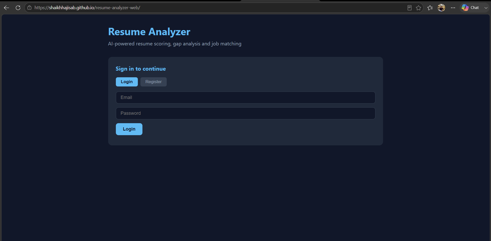
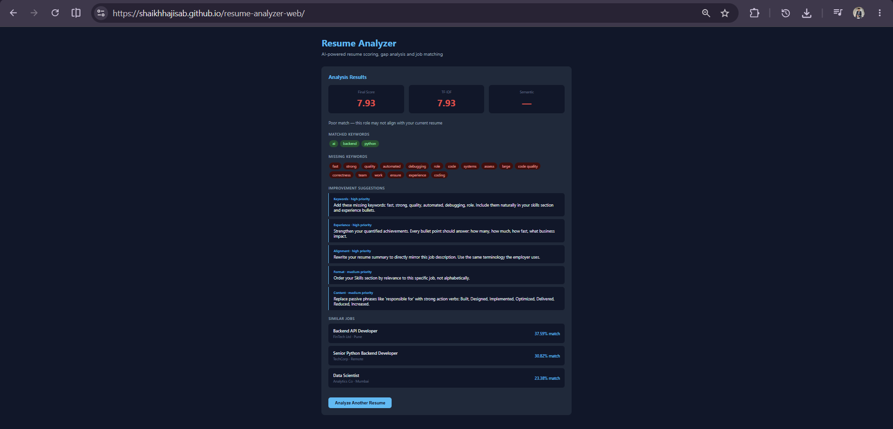

# 🚀 AI-Powered Resume Analyzer & Job Match System

<div align="center">

### Intelligent Resume Screening, Skill Gap Analysis & Job Matching using NLP, BERT, RAG and Vector Search


</div>

---

## 📌 Overview

AI-Powered Resume Analyzer is a full-stack NLP application that automates resume screening and job matching. The system analyzes a candidate's resume against a target job description using keyword matching, semantic similarity, vector search, and LLM-powered recommendations.

This project was designed to simulate a real-world ATS (Applicant Tracking System) and provide recruiters and job seekers with actionable insights.

### 🎯 Key Objectives

- Automate resume screening
- Improve candidate-job matching
- Identify skill gaps
- Generate AI-powered resume improvement suggestions
- Recommend similar job opportunities

---

## ✨ Features

### 📄 Resume Analysis

- Upload PDF Resume
- Extract resume content using PyMuPDF
- Clean and preprocess text
- Store resume history for authenticated users

### 🧠 AI Matching Engine

Combines multiple NLP techniques:

- TF-IDF Keyword Matching
- BERT Semantic Similarity
- Weighted Score Calculation
- Skill Gap Analysis

### 🔍 Keyword Analysis

Automatically identifies:

- Matched Skills
- Missing Skills
- Missing Keywords
- ATS Optimization Opportunities

### 🤖 LLM-Powered Resume Coach

Generates personalized recommendations such as:

- Resume improvement suggestions
- Stronger action verbs
- ATS optimization tips
- Experience enhancement advice
- Keyword alignment recommendations

### 🎯 Similar Job Recommendations

Uses vector similarity search to recommend the most relevant jobs from the database.

Powered by:

- FAISS Vector Search
- Semantic Embeddings
- Ranking Algorithms

### 🔐 Authentication

- JWT Authentication
- Secure Password Hashing (bcrypt)
- Protected Routes
- User-specific Resume Management

---

## 🏗️ System Architecture

```text
                  Resume PDF
                       │
                       ▼
              PDF Text Extraction
                       │
                       ▼
                NLP Processing
                       │
        ┌──────────────┼──────────────┐
        ▼                             ▼
 TF-IDF Matching              BERT Embeddings
        ▼                             ▼
 Keyword Score           Semantic Similarity
        └──────────────┬──────────────┘
                       ▼
              Final Match Score
                       │
        ┌──────────────┼──────────────┐
        ▼                             ▼
 Missing Skills              Similar Jobs
        ▼                             ▼
     LLM Coach              FAISS Search
                       │
                       ▼
                 Final Report
```

---

## 📸 Application Screenshots

### Login & Resume Upload



### Resume Analysis Dashboard



> Replace image paths with your actual screenshots.

---

## 🧠 AI & Machine Learning Pipeline

### 1. Resume Parsing

- PDF Upload
- Text Extraction using PyMuPDF

### 2. Text Preprocessing

- Lowercasing
- Cleaning
- Tokenization
- Stopword Removal

### 3. Keyword Matching

TF-IDF Vectorization measures keyword relevance between:

```text
Resume ↔ Job Description
```

### 4. Semantic Similarity

BERT embeddings capture contextual meaning beyond exact keyword matches.

```text
Resume Embedding
        vs
Job Description Embedding
```

### 5. Final Scoring

```text
Final Score =
70% Semantic Similarity
+
30% Keyword Matching
```

### 6. Similar Job Retrieval

FAISS vector search retrieves the most relevant job opportunities.

---

## 💡 Technical Highlights

### NLP

- TF-IDF Vectorization
- Skill Extraction
- Keyword Analysis
- Resume Parsing

### Deep Learning

- BERT Embeddings
- Semantic Similarity
- Contextual Matching

### Retrieval-Augmented Search

- FAISS Vector Database
- Similar Job Recommendation Engine

### Generative AI

- LLM-Powered Resume Suggestions
- ATS Optimization Recommendations

---

## 🛠️ Technology Stack

### Backend

- FastAPI
- SQLAlchemy
- Alembic
- PostgreSQL

### Machine Learning

- Scikit-Learn
- Hugging Face Inference API
- Sentence Transformers

### Vector Search

- FAISS

### Authentication

- JWT
- bcrypt
- python-jose

### Frontend

- HTML
- CSS
- JavaScript

### Deployment

- GitHub Pages
- Render
- Neon PostgreSQL
- Docker

---

## 📡 API Endpoints

### Authentication

| Method | Endpoint         | Description   |
| ------ | ---------------- | ------------- |
| POST   | `/auth/register` | Register User |
| POST   | `/auth/login`    | Login         |
| GET    | `/auth/me`       | Current User  |

### Resume

| Method | Endpoint                     | Description       |
| ------ | ---------------------------- | ----------------- |
| POST   | `/resume/upload`             | Upload Resume     |
| POST   | `/resume/{id}/full-analysis` | Complete Analysis |
| GET    | `/resume/{id}/similar-jobs`  | Similar Jobs      |
| GET    | `/resume/my-resumes`         | User Resumes      |

---

## ⚙️ Local Setup

### Clone Repository


cd AI-Powered-Resume-Analyzer---Job-Match-System
```

### Create Virtual Environment

```bash
python -m venv venv

# Windows
venv\Scripts\activate

# Linux/Mac
source venv/bin/activate
```

### Install Dependencies

```bash
pip install -r requirements.txt
```

### Configure Environment Variables

```bash
cp .env.example .env
```

Add:

```env
DATABASE_URL=your_database_url
SECRET_KEY=your_secret_key
HUGGINGFACE_API_KEY=your_huggingface_api_key
DEBUG=True
```

### Run Migrations

```bash
alembic upgrade head
```

### Start Application

```bash
uvicorn app.main:app --reload --port 8000
```

Open:

```text
http://localhost:8000/docs
```

---

## 🐳 Docker Setup

```bash
docker-compose up --build
```

---

## 📈 Business Value

### Problem

Recruiters spend significant time manually screening resumes, often relying on keyword-based filtering that misses qualified candidates.

### Solution

This platform:

- Automates resume screening
- Improves candidate-job alignment
- Detects missing skills
- Generates actionable feedback
- Recommends relevant job opportunities

---

## 🎓 What I Learned

During this 1-month project, I gained practical experience in:

- FastAPI Backend Development
- PostgreSQL Database Design
- JWT Authentication
- NLP Pipelines
- TF-IDF Vectorization
- BERT Embeddings
- Semantic Search
- FAISS Vector Databases
- Retrieval-Augmented Generation (RAG)
- Docker Deployment
- Cloud Hosting
- Full-Stack AI Development

---


---

## 👨‍💻 Author

### Prathamesh Rajput

Final Year B.Tech (Artificial Intelligence & Data Science)

Passionate about:

- Artificial Intelligence
- Machine Learning
- NLP
- Generative AI
- Backend Development

**GitHub:**  
https://github.com/Prathamesh16R

**LinkedIn:**
https://www.linkedin.com/in/prathamesh-rajput-59775925a/

---

## ⭐ Recruiter Highlights

✔ End-to-End AI Application

✔ Production-Ready FastAPI Backend

✔ NLP + BERT + FAISS Integration

✔ JWT Authentication

✔ PostgreSQL Database Design

✔ Vector Search Implementation

✔ LLM-Based Resume Recommendations

✔ Dockerized Deployment

✔ Cloud Hosted

✔ Real-World ATS Use Case

✔ Full-Stack AI Engineering Project

---

### If you found this project useful, consider giving it a ⭐ on GitHub.
